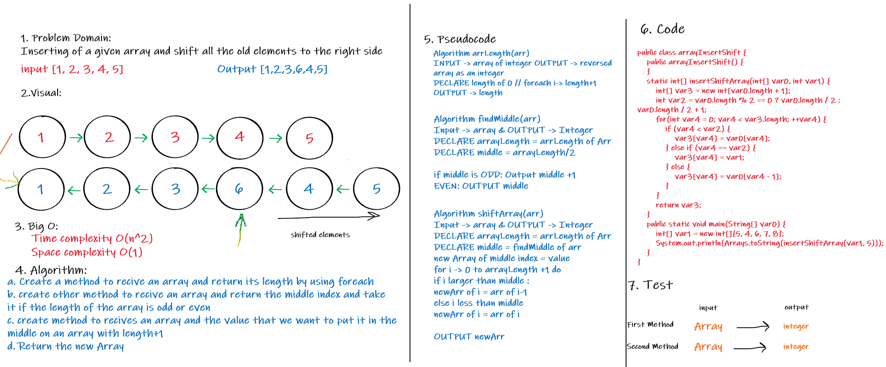

# Insert to Middle of an Array
Define a method to insert an element into the middle index of the array with shifting all elements
after the middle to the right .

## Whiteboard Process

## Approach & Efficiency
initialized a new array and push until racing the middle and after reaching the middle push with decreasing the index
with O(n) Time complexity .