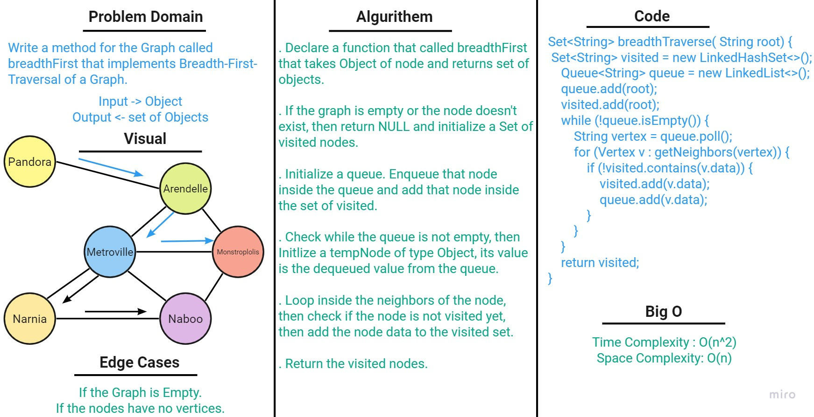

# Code Challenge 35 - Graphs
A graph is data structure consisting of data that is stored among many groups of edges and vertices.

## Challenge

Implement your own Graph. The graph should be represented as an adjacency list, and should include the following methods:

1. add vertex

2. add edge

3. get vertices

4. get neighbors

5. size

## Approach and Efficiency
1. **addNode** method ->
- Space Complexity: O(n)
- Time Complexity: O(1)

2. **addEdge** method ->
- Space Complexity: O(n)
- Time Complexity: O(1)

3. **getNodes** method ->
- Space Complexity: O(n)
- Time Complexity: O(1)

4. **getNeighbors** method ->
- Space Complexity: O(1)
- Time Complexity: O(1)

5. **size** method ->
- Space Complexity: O(1)
- Time Complexity: O(1)

## API

1.  **addNode(String value)** ->  Add a node to the graph and returns the added node value.
2.  **addEdge(String data1, String data2)** -> Adds a new edge between two nodes in the graph.
3. **getNodes()** -> returns all the nodes in the graph as a set collection.
4. **getNeighbors()** -> Returns a collection of edges connected to the given node.
5. **size()** -> Returns the total number of nodes in the graph

---

# Code Challenge 36 - Graph Breadth First
Create a static method which returns a Set of the Graph vertices in their breadth from a specified root.

## Challenge

Create a method that take a vertex as a parameter as a start point and return a collection of vertices in the order they were visited.

## Whiteboard Process

## Approach and Efficiency

* Time: O(n^2)

* Space: O(n)

# Code Challenge 38 - Graph Depth First
Create a static method which returns a Set of the Graph vertices in their Depth from a specified root.

# Challenge 
<!-- Description of the challenge -->
Create a method that take a vertex as a parameter as a start point and return a collection of vertices in the order they were visited.

## Whiteboard Process

## Approach and Efficiency

* Time: O(n^2)

* Space: O(n)
