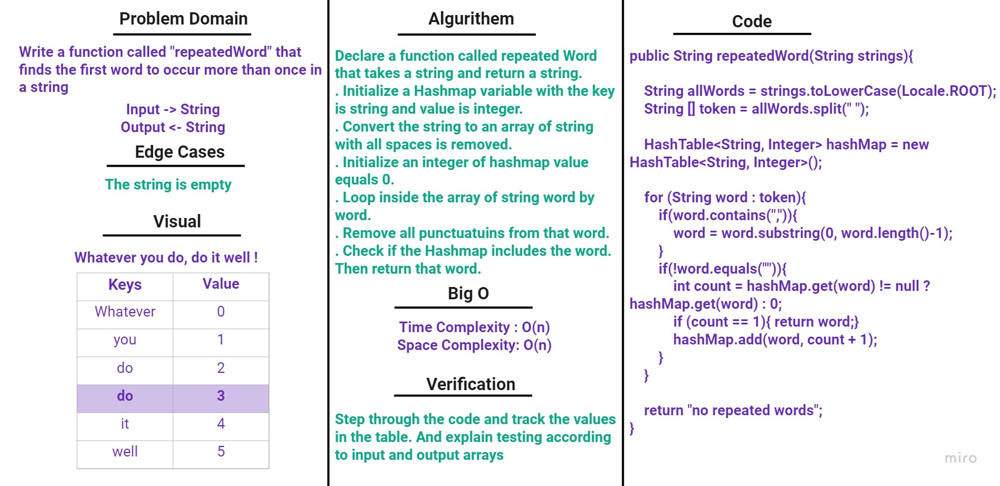
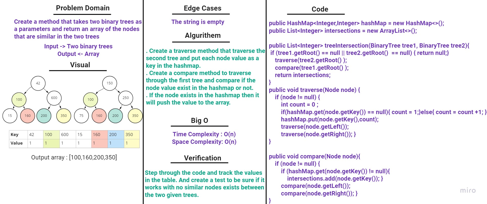
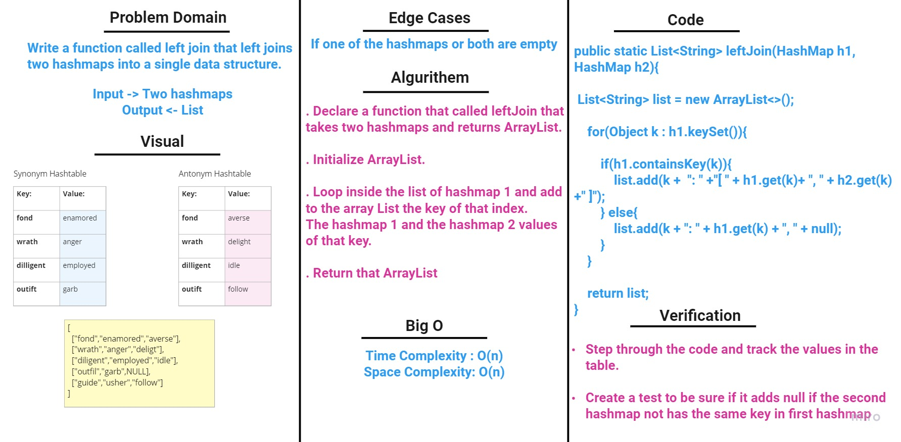

# Hash Table
The Hashtable class implements a hash table, which maps keys to value. To successfully store and retrieve objects from a hashtable, the objects used as keys must implement the hashCode method and the equals' method.

## Challenge
Implement a Hashtable Class with the following methods:
1. add
2. get
3. contains
4. hash

## Approach & Efficiency

**1. Space Complexity**

    - Best case: O(n)
    - Worst case: O(n)

**2. Time Complexity**

**- add:**

    - Best case: O(1)
    - Worst case: O(n)

**- remove:**

    - Best case: O(1)
    - Worst case: O(n)

**- get:**

    - Best case: O(1)
    - Worst case: O(n)

## API
1. `hashCode:` to hash the given Key
2. `getBucketIndex:` to get the index for the key within the size of the array
3. `getSize:` to get the size of all the node in the array
4. `isEmpty:` to check if the array is empty
5. `add:` to add a new element into the array by giving the key and the value
6. `remove:` to remove the node of the given key
7. `get:` to get the value of the given key
8. `contains:` to check if the key is in the hash table

# Hashmap-repeated-word
Write a function that accepted a string parameter which finds the first word to occur more than once in a string and return a string.

## Whiteboard

# Hashmap-tree-intersection
Create a method that takes two binary trees as a parameter and return an array of nodes that are similar in two trees.

## Whiteboard

# Hashmap-left-join
Implement a simplified LEFT JOIN for 2 Hashmaps

Write a method called leftJoin accepts two hash maps as a parameters and return a single data structure. It will add the first hash map to the list and then loop through second hash map to check if the key is in the list, if it exist in the list it will add the value of the key to the same key in the list.

## Whiteboard

