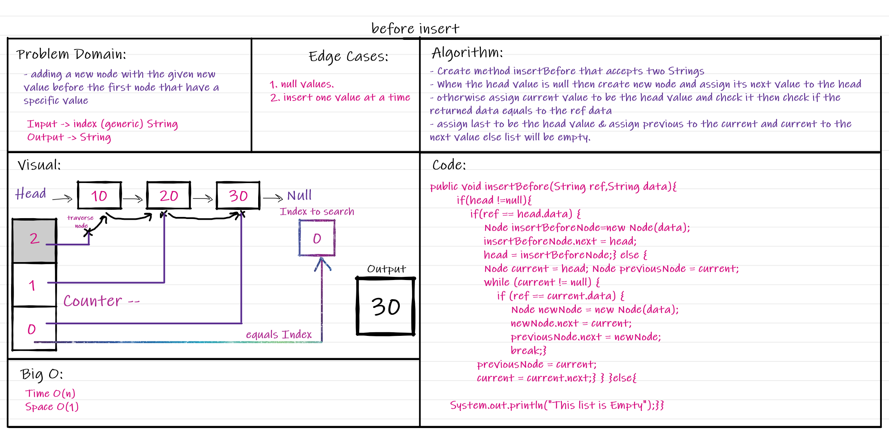
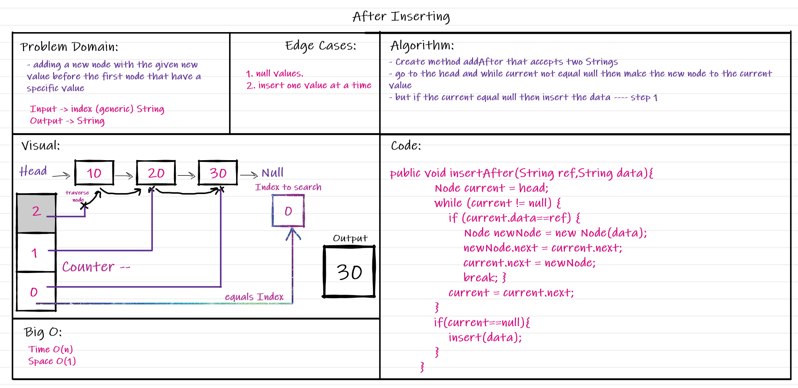
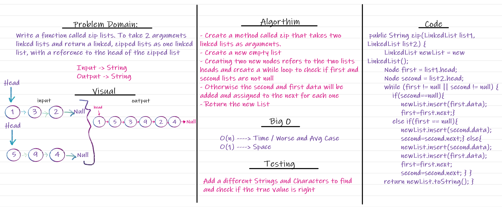

# Singly Linked List
- Is a linear data structure that consists of nodes and each node have the data that it hold and the reference to the next node ,
  Nodes are connected using the next reference which can be scattered and doesn't need to have the adjacent references .

## Challenge
- Implement the linked list using the node and linked list classes .

## Approach & Efficiency
Used Classes to implement the linked list with the O(1) and O(n) for it's methods .

## Code Challenge 06
**Extend a Linked List to allow various insertion methods.**
- `.insertBefore(value, newVal)` which add a new node with the given newValue immediately before the first value node.

- `.append(value):` which adds a new node with the given value to the end of the list.

.png)

- `.insertAfter(value, newVal):` which add a new node with the given newValue immediately after the first value node 

### Challenge 08

