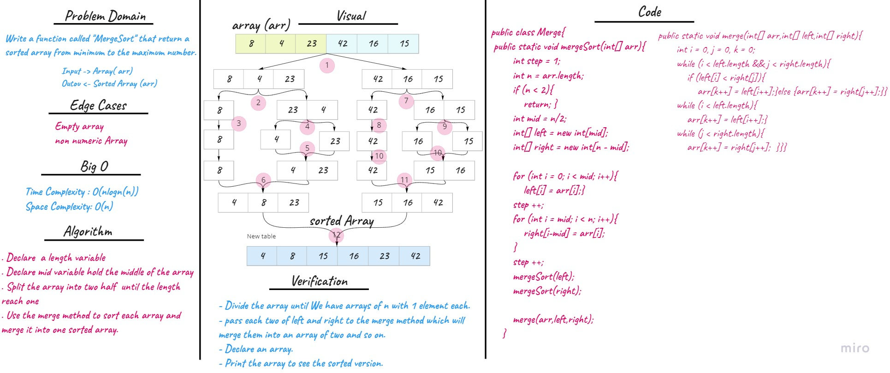

# Insertion Sort
## Challenge Summary
<!-- Description of the challenge -->
This challenge relates to creating a method called `mergeSort (int [] arr) ` that takes an int array as a parameter. The method divides the array into two parts and each part is also divided into two parts until breaking each element into a single part.

Then sort the elements from smallest to largest and merge the divided sorted array together. In the end, the array has been sorted.

### Code
```
ALGORITHM Mergesort(arr)
    DECLARE n <-- arr.length

    if n > 1
      DECLARE mid <-- n/2
      DECLARE left <-- arr[0...mid]
      DECLARE right <-- arr[mid...n]
      // sort the left side
      Mergesort(left)
      // sort the right side
      Mergesort(right)
      // merge the sorted left and right sides together
      Merge(left, right, arr)

ALGORITHM Merge(left, right, arr)
    DECLARE i <-- 0
    DECLARE j <-- 0
    DECLARE k <-- 0

    while i < left.length && j < right.length
        if left[i] <= right[j]
            arr[k] <-- left[i]
            i <-- i + 1
        else
            arr[k] <-- right[j]
            j <-- j + 1

        k <-- k + 1

    if i = left.length
       set remaining entries in arr to remaining values in right
    else
       set remaining entries in arr to remaining values in left
```

## Whiteboard Process
<!-- Embedded whiteboard image -->

## Approach & Efficiency
<!-- What approach did you take? Why? What is the Big O space/time for this approach? -->
**- Time Complexity:** for average and worst case O(nlogn) The basic operation algorithm is comparison

**- Space Complexity:** O(n)

## Solution
<!-- Show how to run your code, and examples of it in action -->

- Divide the array until We have arrays of n with 1 element each.
- pass each two of left and right to the merge method which will merge them into an array of two and so on.
- Declare an array.
- Print the array to see the sorted version.