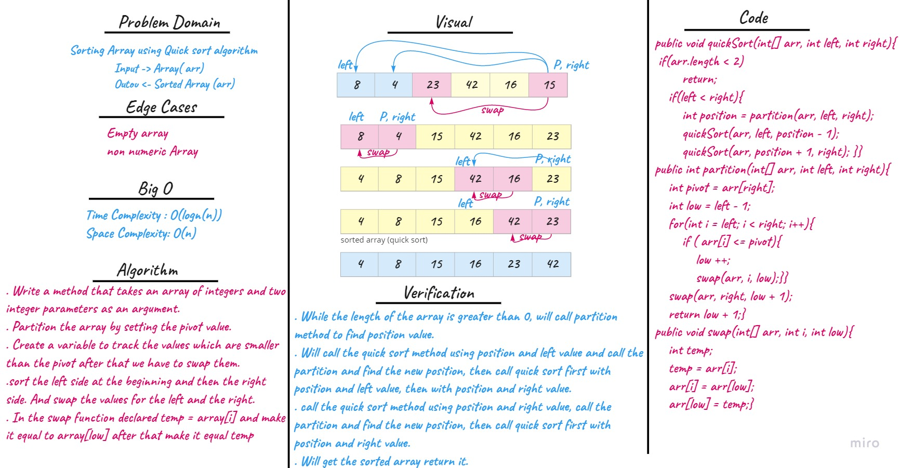
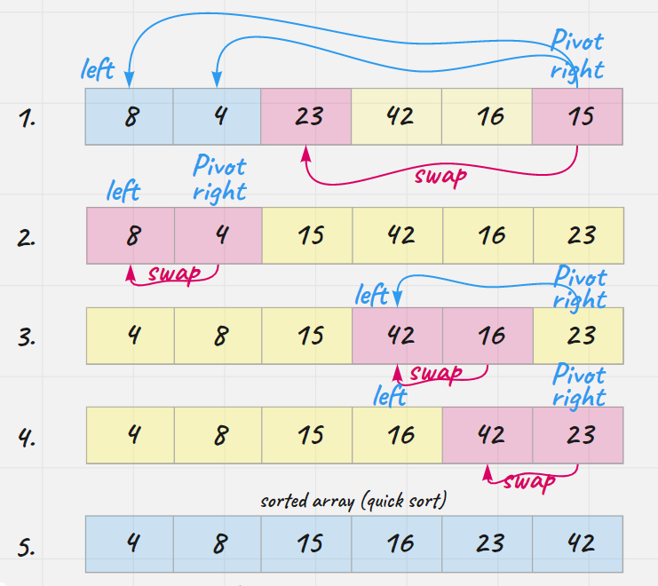

# Quick Sort

Quicksort algorithm repeatedly divides an un-sorted section into a lower order sub-section and a higher order sub-section by comparing to a pivot element. At the end of recursion, we get sorted array.

## Pseudocode

```
ALGORITHM QuickSort(arr, left, right)
    if left < right
        // Partition the array by setting the position of the pivot value
        DEFINE position <-- Partition(arr, left, right)
        // Sort the left
        QuickSort(arr, left, position - 1)
        // Sort the right
        QuickSort(arr, position + 1, right)

ALGORITHM Partition(arr, left, right)
    // set a pivot value as a point of reference
    DEFINE pivot <-- arr[right]
    // create a variable to track the largest index of numbers lower than the defined pivot
    DEFINE low <-- left - 1
    for i <- left to right do
        if arr[i] <= pivot
            low++
            Swap(arr, i, low)

     // place the value of the pivot location in the middle.
     // all numbers smaller than the pivot are on the left, larger on the right.
     Swap(arr, right, low + 1)
    // return the pivot index point
     return low + 1

ALGORITHM Swap(arr, i, low)
    DEFINE temp;
    temp <-- arr[i]
    arr[i] <-- arr[low]
    arr[low] <-- temp
```

## Whiteboard Process
<!-- Embedded whiteboard image -->


## Trace

1. Write a method that takes an array of integers and two integer parameters as an argument.
2. Partition the array by setting the pivot value.
3. Create a variable to track the values which are smaller than the pivot after that we have to swap them.
4. sort the left side at the beginning and then the right side. And swap the values for the left and the right.
5. In the swap function declared temp = array[i] and make it equal to array[low] after that make it equal temp

## Approach & Efficiency
<!-- What approach did you take? Why? What is the Big O space/time for this approach? -->
**- Time Complexity:** for average and worst case `log(n)` The basic operation algorithm is comparison

**- Space Complexity:** `O(n)` 

## Solution
<!-- Show how to run your code, and examples of it in action -->

- While the length of the array is greater than 0, will call partition method to find position value.
- Will call the quick sort method using position and left value and call the partition and find the new position, then call quick sort first with position and left value, then with position and right value.
- Call the quick sort method using position and right value, call the partition and find the new position, then call quick sort first with position and right value.
- Will get the sorted array return it.