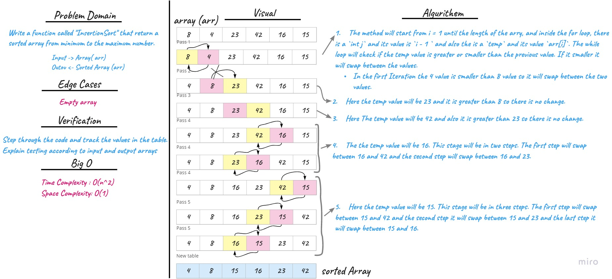

# Insertion Sort
## Challenge Summary
<!-- Description of the challenge -->
This challenge relates to creating a method called `insartionSort (int [] arr) ` that takes an int array as a parameter. The purpose of this method is to sort an unsorted array in ascending order.
### Pesudocode
```
InsertionSort(int[] arr)

    FOR i = 1 to arr.length

      int j <-- i - 1
      int temp <-- arr[i]

      WHILE j >= 0 AND temp < arr[j]
        arr[j + 1] <-- arr[j]
        j <-- j - 1

      arr[j + 1] <-- temp
```

## Whiteboard Process
<!-- Embedded whiteboard image -->

## Approach & Efficiency
<!-- What approach did you take? Why? What is the Big O space/time for this approach? -->
**- Time Complexity:** for average and worst case O(n^2) The basic operation algorithm is comparison 

**- Space Complexity:** O(1) No extra space needed

## Solution
<!-- Show how to run your code, and examples of it in action -->

You need to call selectionSort method and insert your array.