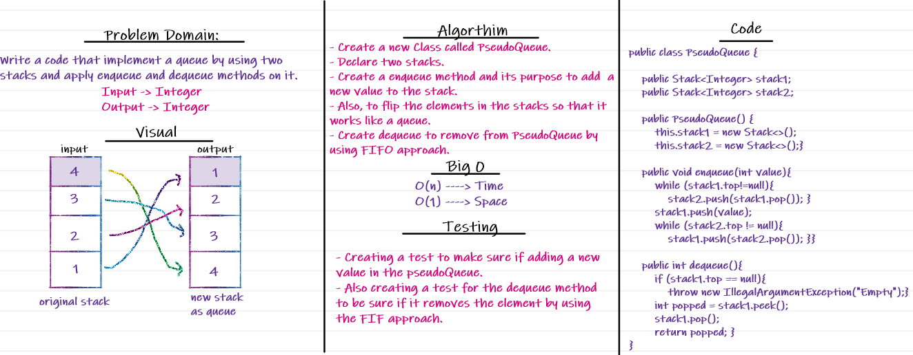

# Stack and Queue

## Stacks and Queues
<!-- Short summary or background information -->
- **Stack** contains objects that are pushed and popped according to the last-in first-out (LIFO) principle.
- **Queue** contains objects that are enqueued and dequeued according to the first-in first-out (FIFO) principle.

## Challenges
<!-- Description of the challenge -->
Using a Linked List, Implement both a Stack, and a Queue:

### **1. Stack:**
A stack is a data structure that consists of Nodes. Each Node references the next Node in the stack, but does not reference its previous.
Node class has properties for the value stored in the Node, and a pointer to the next node.

-**push**  
  *Arguments: value.* Adds a new node with that value to the top of the stack with an O(1) Time performance.
- **pop**  
  *Arguments: none.* Returns: the value from node from the top of the stack
  Removes the node from the top of the stack
- **peek**  
  *Arguments: none.* Returns: Value of the node located at the top of the stack
- **isEmpty**  
  *Arguments: none.* Returns: Boolean indicating whether the stack is empty.

### **2. Queue:**

- **Enqueue ->** Nodes or items that are added to the queue.
- **Dequeue ->** Nodes or items that are removed from the queue.
- **Front ->** This is the front/first Node of the queue.
- **Rear ->** This is the rear/last Node of the queue.
- **Peek ->** When you peek you will view the value of the front Node in the queue.
- **IsEmpty ->** returns true when queue is empty otherwise returns false.

## Approach & Efficiency
```java
Space O(n)
Time O(1)
```
### Challenge 11 - Implement a Queue using two Stacks.


