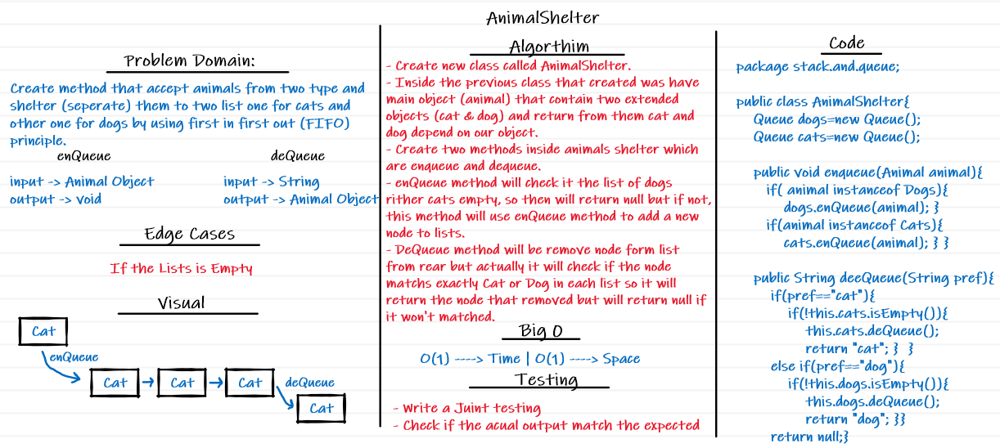

# Stack and Queue (AnimalShelter)

## Challenge Summary
<!-- Description of the challenge -->
Create method that accept animals from two type and shelter (separate) them to two list one for cats and one for dogs by  using first in first out principle

## Stacks and Queues
<!-- Short summary or background information -->
- **Stack** contains objects that are pushed and popped according to the last-in first-out (LIFO) principle.
- **Queue** contains objects that are enqueued and dequeued according to the first-in first-out (FIFO) principle.

## Whiteboard Process
<!-- Embedded whiteboard image -->


## Approach & Efficiency
Space O(1)
Time O(1)


## Solution
<!-- Show how to run your code, and examples of it in action -->
```
package stack.and.queue;

public class AnimalShelter{
    Queue dogs=new Queue();
    Queue cats=new Queue();

    public void enqueue(Animal animal){
       if( animal instanceof Dogs){
           dogs.enQueue(animal);
       }
       if(animal instanceof Cats){
           cats.enQueue(animal);
       }
    }
    public String deeQueue(String pref){
        if(pref=="cat"){
            if(!this.cats.isEmpty()){
                this.cats.deQueue();
                return "cat";
            }
        }
        else if(pref=="dog"){
            if(!this.dogs.isEmpty()){
                this.dogs.deQueue();
                return "dog";
            }
        }
        return null;
    }
```
"{Front<-{dog}<-Rear}"
"{Front<-Rear}"

