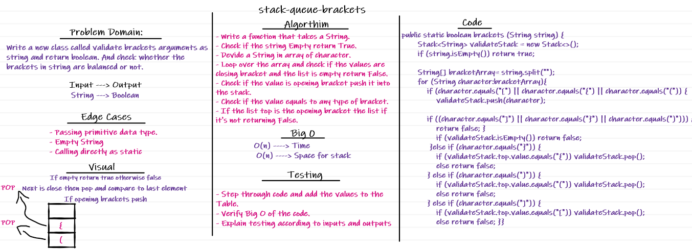

## Code Challenge 13
### Write a function called validate brackets
Arguments: string
Return: boolean
### representing whether the brackets in the string are balanced
There are 3 types of brackets:
- Round Brackets : `()`
- Square Brackets : `[]`
- Curly Brackets : `{}`

