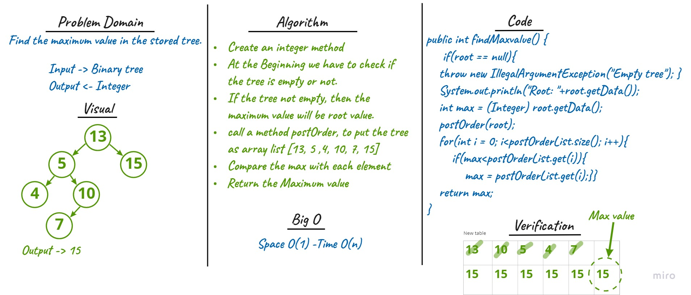

# Trees
- Binary Search Trees: is a rooted binary tree data structure whose internal nodes each store a key greater than all the keys in the node's left subtree and less than those in its right subtree.

### Methods in Binary Search Tree class

* `add(int key)`: Adds a new node with that value in the correct location in the binary search tree.

* `contains(int key)`: Returns boolean indicating whether the value is in the tree at least once.

* `traverse (Node current, int key)`: Check the value from `add()` method to put it in the right location.

**Traversals**:

Traversing a tree allows us to search for a node and print out the contents of a tree.

**Depth First**

Depth first traversal is where we prioritize going through the height of the tree first. There are three methods for depth first traversal:
1. Pre-order: `root >> left >> right`
2. In-order: `left >> root >> right`
3. Post-order: `left >> right >> root`

## Challenge
1. Create a Node class that has properties for the value stored in the node, the left child node, and the right child node.
2. Implement a binary search tree

## Approach & Efficiency
- **Time**
    - insertion and search operations is O(n)
- **Space**
    - O(1)

## Whiteboard 
*Binary search trees*

## API 
[Binary Search Tree](challenges/trees/lib/src/main/java/trees/BinarySearchTree.java)
- **add: *input integer:*** to add a new node to the tree and if the number was larger than the root go to the right and if smaller go to the left
- **contain: *input integer:*** search the tree if the value exists and return true if it does or false if it doesn't